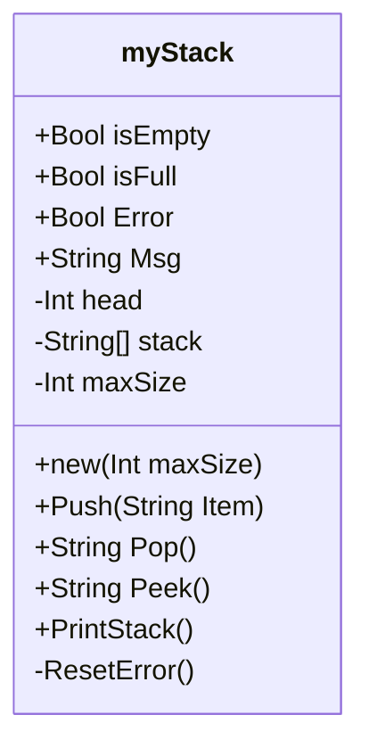

# Project Documentation  
## Class Diagrams  
### Stack  

#### Class Properties

|Name|Scope|Type|Purpose|  
|-|-|-|-|  
|isEmpty|Public get|Bool|Indicates if Stack is Empty|  
|isFull|Public get|Bool|Indicates if Stack is Full|  
|Error|Public get|Bool|Indicates if last action created an error|
|Msg|Public get|String|Text message of outcome of last action|
|head|Private|Int|Pointer to head of stack|
|maxSize|Private|Int|maximum size of stack|
|stack|Private|string[]|Array of size maxSize, holds stack data|

#### Class Methods - Public

**new** 
- In: maxSize
- Out: Object : *myStack*  
Constructor method for class.  takes maximum stack size as parameter.

**Pop**
- In: none
- Out: Item : *String*  
Removes and returns the item at the top of the stack, if stack is empty it returns an empty string, sets the Error flag and sets message to "Stack Underflow"  

**Push**
- In: Item : *String*
- Out: none  
Adds an item at the top of the stack, if stack is full it sets the Error flag to *true* and sets message to "Stack Overflow"  

**Peek**
- In: none
- Out: Item : *String*  
Returns the item at the top of the stack without removing, if stack is empty it returns an empty string, sets the Error flag and sets message to "Stack Empty"  

**PrintStack**
- In: none  
- Out: none  
Writes the contents of the stack to the Console.  

#### Class Methods - Private (Internal)

**ResetError**
- In: none
- Out: none  

Resets the Error property to *false* and Msg property to empty string
